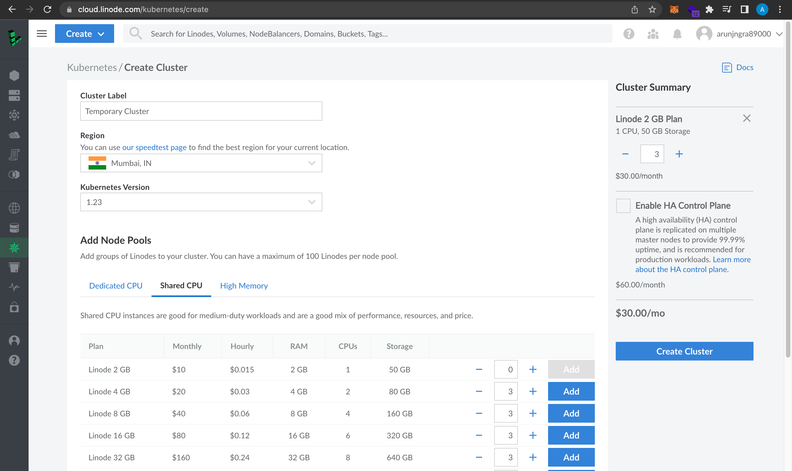
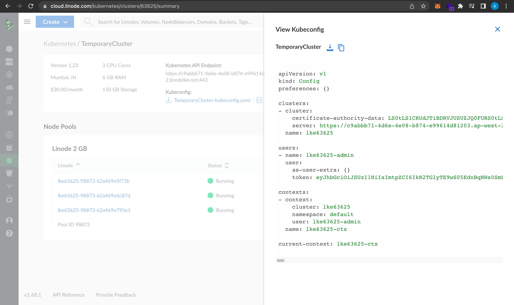

# Kubernetes Basics ⛵

In docker we faced a problem called container orchestration so for solution of that there was docker swarm but another solution offered by google is **Kubernetes**

Now to set up we can use GCP, Azure or **LINODE**
We can configure our Kubernetes using Linode cloud provider →

[https://cloud.linode.com/kubernetes/create](https://cloud.linode.com/kubernetes/create)

Now fill the details and create a node



Now after creating we will get a master node link and three nodes which we selected


Now we need to install kubectl on our host machine which is required for using kubernetes.

```bash
curl -LO https://storage.googleapis.com/kubernetes-release/release/$(curl -s https://storage.googleapis.com/kubernetes-release/release/stable.txt)/bin/linux/amd64/kubectl
```

→ 

```bash
% Total    % Received % Xferd  Average Speed   Time    Time     Time  Current
                                 Dload  Upload   Total   Spent    Left  Speed
100 43.5M  100 43.5M    0     0  7513k      0  0:00:05  0:00:05 --:--:-- 8750k
```

Now in the directory we have our kubectl and we need to configure it now →

```bash
chmod +x kubectl
sudo mv ./kubectl /usr/local/bin/kubectl
```

Now copy our kubernetes yaml config file



```bash
nano kubeconfig.yaml
```

And here paste it and save the file

→ Export the file name as a variable

```bash
export KUBECONFIG=kubeconfig.yaml
```

## For MacOS

```bash
brew install kubectl
# This will install and link the kubectl to CLI
```

→ Now continuing

### To get the nodes on the cluster (for this to work we need to specify our kubeconfig.yaml file )

```bash
kubectl get nodes
```

→ Get nodes

```bash
NAME                          STATUS   ROLES    AGE    VERSION
lke63625-98873-62a469e5f73b   Ready    <none>   133m   v1.23.6
lke63625-98873-62a469e6c87d   Ready    <none>   133m   v1.23.6
lke63625-98873-62a469e795e1   Ready    <none>   133m   v1.23.6
```

### To get info about the cluster

```bash
kubectl cluster-info
```

→

```bash
Kubernetes control plane is running at https://c9abbb71-4d6e-4e08-b874-e99614d81203.ap-west-2.linodelke.net:443
KubeDNS is running at https://c9abbb71-4d6e-4e08-b874-e99614d81203.ap-west-2.linodelke.net:443/api/v1/namespaces/kube-system/services/kube-dns:dns/proxy

To further debug and diagnose cluster problems, use 'kubectl cluster-info dump'.
```

### To run our image

```bash
kubectl run <pesonalized_name> --image=<image_path> --port=<port_you_want_to_run_container_on>
```

This will run our application in a pod 

### To get pods running

```bash
kubectl get pods
```

### To get the more info about the running pods

```bash
kubectl describe pods
```

## Deployment

Now if we want to deploy our machine to the worker nodes and we want to specify what we need in each node then we need to do it by defining in a yaml file

For eg:

```yaml
apiVersion: apps/v1
kind: Deployment
metadata:
  name: networkchuckcoffee-deployment
  labels:
    app: nccoffee
spec:
  replicas: 3
  selector:
    matchLabels:
      app: nccoffee
  template:
    metadata:
      labels:
        app: nccoffee
    spec:
      containers:
      - name: nccoffee
        image: thenetworkchuck/nccoffee:pourover
        imagePullPolicy: Always
        ports:
        - containerPort: 80
```

To deploy using the config defined by us in this yaml file we will use this command

```bash
kubectl apply -f <yaml_filename>
```

### Delete a pod

```bash
kubectl delete pods <podname>
```

### Get deployments

```bash
kubectl get deployments
```

### Edit deployment

Now in kubernetes it always keeps checking that how our deployment is performing like if I specified i need 3 replicas of my application then it keeps ensuring that I need 3 instances of our application running all the time

We can also edit our deployment by editing the file

```bash
kubectl get deployments
kubectl edit deployment <deployment_name>
```

### Getting more details or pods

```bash
kubectl get pods -o wide
```

## Service

Now if we need to make our website accessible to whole over the internet then we need to expose our container and for that we will user service and it will also act as an load balancer

service example

```yaml
apiVersion: v1
kind: Service
metadata:
  name: coffee-service
  annotations:
    service.beta.kubernetes.io/linode-loadbalancer-throttle: "4"
  labels:
    app: coffee-service
spec:
  type: LoadBalancer
  ports:
  - name: http
    port: 80
    protocol: TCP
    targetPort: 80
  selector:
    app: nccoffee
  sessionAffinity: None
```

→

```bash
nano  coffee-service.yaml
kubectl apply -f coffee-service.yaml
```

### Get running services

```bash
kubectl get services
```

For more details about a service

```bash
kubectl describe services <service_name>
```

---

Requirements

```bash
- Kubernetes
- Minikube
- Docker
```

Configure minikube

```bash
minikube start --driver=docker

--------
😄  minikube v1.30.1 on Darwin 13.3.1
✨  Using the docker driver based on user configuration
📌  Using Docker Desktop driver with root privileges
👍  Starting control plane node minikube in cluster minikube
🚜  Pulling base image ...
    > gcr.io/k8s-minikube/kicbase...:  373.53 MiB / 373.53 MiB  100.00% 2.84 Mi
🔥  Creating docker container (CPUs=2, Memory=2200MB) ...
🐳  Preparing Kubernetes v1.26.3 on Docker 23.0.2 ...
    ▪ Generating certificates and keys ...
    ▪ Booting up control plane ...
    ▪ Configuring RBAC rules ...
🔗  Configuring bridge CNI (Container Networking Interface) ...
    ▪ Using image gcr.io/k8s-minikube/storage-provisioner:v5
🔎  Verifying Kubernetes components...
🌟  Enabled addons: storage-provisioner, default-storageclass
🏄  Done! kubectl is now configured to use "minikube" cluster and "default" namespace by default
--------

minikube status # tells us about the status of server

--------
minikube
type: Control Plane
host: Running
kubelet: Running
apiserver: Running
kubeconfig: Configured
--------

minikube ip # tells us about the server ip
```

ssh - minikube

```bash
minikube ssh
```

```bash

λ  ~  kubectl get nodes
NAME       STATUS   ROLES           AGE     VERSION
minikube   Ready    control-plane   3m28s   v1.26.3

λ  ~  kubectl get namespaces
NAME              STATUS   AGE
default           Active   4m11s
kube-node-lease   Active   4m15s
kube-public       Active   4m15s
kube-system       Active   4m16s

λ  ~  kubectl get pods --namespace=kube-system
NAME                               READY   STATUS    RESTARTS   AGE
coredns-787d4945fb-dmxln           1/1     Running   0          4m53s
etcd-minikube                      1/1     Running   0          5m5s
kube-apiserver-minikube            1/1     Running   0          5m4s
kube-controller-manager-minikube   1/1     Running   0          5m4s
kube-proxy-8w89j                   1/1     Running   0          4m54s
kube-scheduler-minikube            1/1     Running   0          5m5s
storage-provisioner                1/1     Running   0          4m47s
```

creating pods

```bash
kubectl run nginx --image=nginx
```

pod commands

```bash
kubectl describe pod nginx
```

Accessing the container 

- minikube ssh

```bash
docker@minikube:~$ docker ps
CONTAINER ID   IMAGE                       COMMAND                  CREATED          STATUS          PORTS     NAMES
22b0ac286045   nginx                       "/docker-entrypoint.…"   5 minutes ago    Up 5 minutes              k8s_nginx_nginx_default_c8bc183a-de0f-4d02-a435-63b2d3e20747_0
2e0411f739c0   registry.k8s.io/pause:3.9   "/pause"                 5 minutes ago    Up 5 minutes              k8s_POD_nginx_default_c8bc183a-de0f-4d02-a435-63b2d3e20747_0
a0db5789e937   6e38f40d628d                "/storage-provisioner"   12 minutes ago   Up 12 minutes             k8s_storage-provisioner_storage-provisioner_kube-system_fab2000e-95c1-4025-8f28-74aba9665cbb_0
61446f64c99d   registry.k8s.io/pause:3.9   "/pause"                 12 minutes ago   Up 12 minutes             k8s_POD_storage-provisioner_kube-system_fab2000e-95c1-4025-8f28-74aba9665cbb_0
32db8541dfe5   5185b96f0bec                "/coredns -conf /etc…"   12 minutes ago   Up 12 minutes             k8s_coredns_coredns-787d4945fb-dmxln_kube-system_46e5799d-389b-4e1e-b2f0-5bd29a8f4dd9_0
47721954f2a4   registry.k8s.io/pause:3.9   "/pause"                 12 minutes ago   Up 12 minutes             k8s_POD_coredns-787d4945fb-dmxln_kube-system_46e5799d-389b-4e1e-b2f0-5bd29a8f4dd9_0
2c2ac7f8ab18   92ed2bec97a6                "/usr/local/bin/kube…"   12 minutes ago   Up 12 minutes             k8s_kube-proxy_kube-proxy-8w89j_kube-system_74106fb9-4459-4ffe-85a9-3815b4f1df71_0
e6011c45a1f7   registry.k8s.io/pause:3.9   "/pause"                 12 minutes ago   Up 12 minutes             k8s_POD_kube-proxy-8w89j_kube-system_74106fb9-4459-4ffe-85a9-3815b4f1df71_0
21ce2445eb26   fce326961ae2                "etcd --advertise-cl…"   13 minutes ago   Up 13 minutes             k8s_etcd_etcd-minikube_kube-system_d59d6e9872abe47b5a2578072778f755_0
d4992ed31fc3   1d9b3cbae03c                "kube-apiserver --ad…"   13 minutes ago   Up 13 minutes             k8s_kube-apiserver_kube-apiserver-minikube_kube-system_2000cc64446a6d814c0e4a3fd7eefdb7_0
a8b3031c53ff   5a7904736932                "kube-scheduler --au…"   13 minutes ago   Up 13 minutes             k8s_kube-scheduler_kube-scheduler-minikube_kube-system_0818f4b1a57de9c3f9c82667e7fcc870_0
8ae3c06858b6   ce8c2293ef09                "kube-controller-man…"   13 minutes ago   Up 13 minutes             k8s_kube-controller-manager_kube-controller-manager-minikube_kube-system_466b9e73e627277a8c24637c2fa6442d_0
c34c6e9c1f9b   registry.k8s.io/pause:3.9   "/pause"                 13 minutes ago   Up 13 minutes             k8s_POD_kube-scheduler-minikube_kube-system_0818f4b1a57de9c3f9c82667e7fcc870_0
1e60619d6362   registry.k8s.io/pause:3.9   "/pause"                 13 minutes ago   Up 13 minutes             k8s_POD_kube-controller-manager-minikube_kube-system_466b9e73e627277a8c24637c2fa6442d_0
15f33b952657   registry.k8s.io/pause:3.9   "/pause"                 13 minutes ago   Up 13 minutes             k8s_POD_kube-apiserver-minikube_kube-system_2000cc64446a6d814c0e4a3fd7eefdb7_0
fa29ac8194be   registry.k8s.io/pause:3.9   "/pause"                 13 minutes ago   Up 13 minutes             k8s_POD_etcd-minikube_kube-system_d59d6e9872abe47b5a2578072778f755_0
docker@minikube:~$ docker ps | grep "nginx"
22b0ac286045   nginx                       "/docker-entrypoint.…"   5 minutes ago    Up 5 minutes              k8s_nginx_nginx_default_c8bc183a-de0f-4d02-a435-63b2d3e20747_0
2e0411f739c0   registry.k8s.io/pause:3.9   "/pause"                 5 minutes ago    Up 5 minutes              k8s_POD_nginx_default_c8bc183a-de0f-4d02-a435-63b2d3e20747_0

docker@minikube:~$ docker exec -it 22b0ac286045 sh
# hostname
nginx
# ls
bin  boot  dev  docker-entrypoint.d  docker-entrypoint.sh  etc  home  lib  lib64  media  mnt  opt  proc  root  run  sbin  srv  sys  tmp  usr  var
#
```

```bash
λ  ~  kubectl get pods -o wide
NAME    READY   STATUS    RESTARTS   AGE     IP           NODE       NOMINATED NODE   READINESS GATES
nginx   1/1     Running   0          9m41s   10.244.0.3   minikube   <none>           <none>
```

```bash
λ  ~  kubectl delete pod nginx
pod "nginx" deleted
```

Creating the deployments

```bash
λ  ~  kubectl create deployment nginx --image=nginx
deployment.apps/nginx created
```

```bash
λ  ~  kubectl describe deployment nginx 
Name:                   nginx
Namespace:              default
CreationTimestamp:      Wed, 03 May 2023 01:11:54 +0530
Labels:                 app=nginx
Annotations:            deployment.kubernetes.io/revision: 1
Selector:               app=nginx
Replicas:               1 desired | 1 updated | 1 total | 1 available | 0 unavailable
StrategyType:           RollingUpdate
MinReadySeconds:        0
RollingUpdateStrategy:  25% max unavailable, 25% max surge
Pod Template:
  Labels:  app=nginx
  Containers:
   nginx:
    Image:        nginx
    Port:         <none>
    Host Port:    <none>
    Environment:  <none>
    Mounts:       <none>
  Volumes:        <none>
Conditions:
  Type           Status  Reason
  ----           ------  ------
  Available      True    MinimumReplicasAvailable
  Progressing    True    NewReplicaSetAvailable
OldReplicaSets:  <none>
NewReplicaSet:   nginx-748c667d99 (1/1 replicas created)
Events:
  Type    Reason             Age   From                   Message
  ----    ------             ----  ----                   -------
  Normal  ScalingReplicaSet  102s  deployment-controller  Scaled up replica set nginx-748c667d99 to 1
```

scaling

```bash
λ  ~  kubectl scale deployment nginx --replicas=5
deployment.apps/nginx scaled
λ  ~  kubectl get pods                             
NAME                     READY   STATUS              RESTARTS   AGE
nginx-748c667d99-47gjc   0/1     ContainerCreating   0          6s
nginx-748c667d99-5c7kx   1/1     Running             0          8m36s
nginx-748c667d99-grxrn   0/1     ContainerCreating   0          6s
nginx-748c667d99-ncfxt   0/1     ContainerCreating   0          6s
nginx-748c667d99-t9htq   0/1     ContainerCreating   0          6s
```

```bash
λ  ~  kubectl get pods -o wide
NAME                     READY   STATUS    RESTARTS   AGE     IP           NODE       NOMINATED NODE   READINESS GATES
nginx-748c667d99-47gjc   1/1     Running   0          67s     10.244.0.5   minikube   <none>           <none>
nginx-748c667d99-5c7kx   1/1     Running   0          9m37s   10.244.0.4   minikube   <none>           <none>
nginx-748c667d99-grxrn   1/1     Running   0          67s     10.244.0.6   minikube   <none>           <none>
nginx-748c667d99-ncfxt   1/1     Running   0          67s     10.244.0.7   minikube   <none>           <none>
nginx-748c667d99-t9htq   1/1     Running   0          67s     10.244.0.8   minikube   <none>           <none>
```

```bash
λ  ~  kubectl scale deployment nginx --replicas=3
deployment.apps/nginx scaled
λ  ~  kubectl get pods                           
NAME                     READY   STATUS    RESTARTS   AGE
nginx-748c667d99-5c7kx   1/1     Running   0          11m
nginx-748c667d99-grxrn   1/1     Running   0          2m49s
nginx-748c667d99-t9htq   1/1     Running   0          2m49s
λ  ~  kubectl get pods -o wide                   
NAME                     READY   STATUS    RESTARTS   AGE     IP           NODE       NOMINATED NODE   READINESS GATES
nginx-748c667d99-5c7kx   1/1     Running   0          11m     10.244.0.4   minikube   <none>           <none>
nginx-748c667d99-grxrn   1/1     Running   0          2m55s   10.244.0.6   minikube   <none>           <none>
nginx-748c667d99-t9htq   1/1     Running   0          2m55s   10.244.0.8   minikube   <none>           <none>
```

Exposing the application

```bash
λ  ~  kubectl expose deployment nginx --port=8080 --target-port=80
service/nginx exposed
λ  ~  kubectl get service
NAME         TYPE        CLUSTER-IP       EXTERNAL-IP   PORT(S)    AGE
kubernetes   ClusterIP   10.96.0.1        <none>        443/TCP    42m
nginx        ClusterIP   10.107.176.110   <none>        8080/TCP   20s
```

This is exposed to the kubernetes cluster.

```bash
λ  ~  kubectl describe service nginx
Name:              nginx
Namespace:         default
Labels:            app=nginx
Annotations:       <none>
Selector:          app=nginx
Type:              ClusterIP
IP Family Policy:  SingleStack
IP Families:       IPv4
IP:                10.107.176.110
IPs:               10.107.176.110
Port:              <unset>  8080/TCP
TargetPort:        80/TCP
Endpoints:         10.244.0.4:80,10.244.0.6:80,10.244.0.8:80
Session Affinity:  None
Events:            <none>
```

Exposing to the system outside the clusters

```bash
kubectl expose deployment <name_deployment> --type=NodePort --port=3000
kubectl expose deployment <name_deployment> --type=LoadBalancer --port=3000
```
